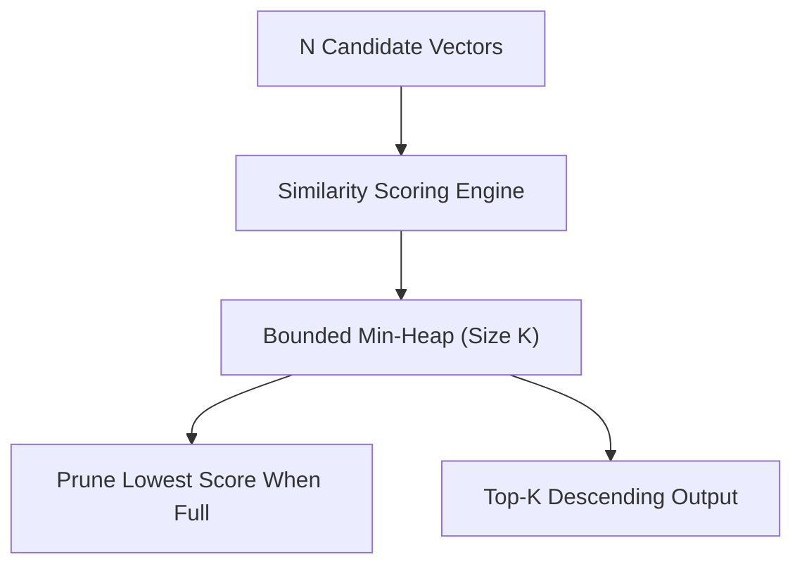

# genpark-vector-similarity-exact-and-topk-heap-selector-skill

Bounded Min-Heap Top-K vector selector for exact cosine similarity and Euclidean distance ranking.

## Architecture

## Features
- **O(N log K) Complexity**: Fixed memory footprint without sorting full array.
- **Metric Options**: Supports both cosine similarity and Euclidean distance.
